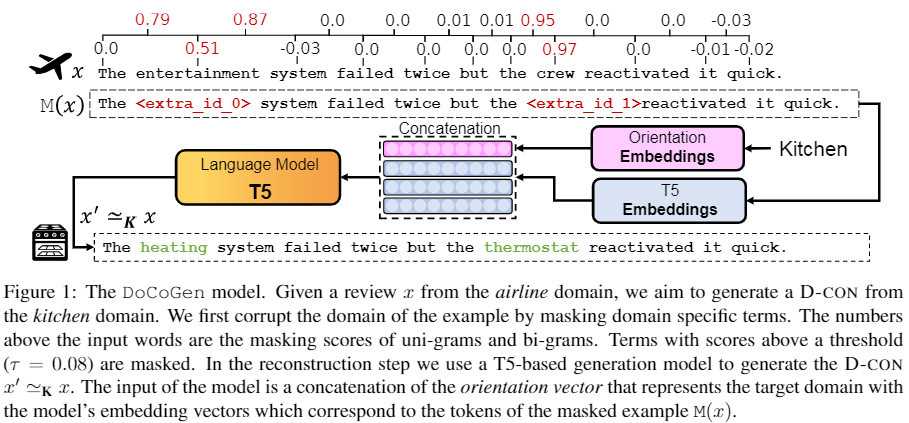

<div align="center">


Our code is implemented in [PyTorch](https://pytorch.org/), using the [Transformers 🤗](https://github.com/huggingface/transformers) and [PyTorch-Lightning ⚡](https://www.pytorchlightning.ai/) libraries. 

</div>

______________________________________________________________________

# DoCoGen - Domain Counterfactual Generator

### Official code repository for the ACL'2022 paper: <br> ["DoCoGen: Domain Counterfactual Generation for Low Resource Domain Adaptation"](https://arxiv.org/abs/2202.12350)
 
DoCoGen is a controllable generation model for generating domain-counterfactual textual examples (D-con).
Given an input text example, DoCoGen generates its D-con -- that is similar to the original in all aspects,
including the task label, but its domain is changed to a desired one. 
DoCoGen intervenes on the domain-specific terms of its input example, replacing them with terms that are relevant
for its target domain while keeping all other properties fixed, including the task label.
It is trained using only unlabeled examples from multiple domains -- no NLP task labels or pairs of textual examples
and their domain-counterfactuals are required.



If you use this code please cite our paper (see [recommended](#docogen_citation) citation below).

While we proposed a controllable generation model for generating domain-counterfactuals in our paper, the code 
in this repo is not limited to controlling only the domain but rather any concept or attribute available in the data.<br>
Note that we include only the code of the DoCoGen generator, thus you can augment your own classifier. <br>
If you wish to fully reproduce the DA results of our paper, including the data splits and the baselines,
please contact us.


______________________________________________________________________

# DoCoGen Lite - single script version
<a name="lite"/>

The DoCoGen Lite script is a single script version of the DoCoGen generator.
It is a more simple and readable code that does not require PyTorch-Lightning.
Although there are minor differences from the [official code](#paper_code) which was used in the paper,
these differences are not significant.
If you have a conda environment with the required packages (nltk, 🤗-transformers, and 🤗-datasets) --
you can run the script without any additional installation.

## How to Run the Code - TL;DR

```bash
git clone https://github.com/nitaytech/DoCoGen.git
cd DoCoGen
conda env create -f docogen_lite_env.yml
conda activate docogen_lite_env
unzip data/paper_data.zip -d data/
python docogen_lite.py --dataset_file_path data/reviews.json --output_dir path/to/output_dir --domains_to_control airline dvd electronics kitchen
```


## Arguments

```text
  -h, --help            show this help message and exit
  --dataset_file_path DATASET_FILE_PATH
                        (str) Path to the dataset file (.json). Must include
                        the following fields: "text", "domain"
  --output_dir OUTPUT_DIR
                        (str) Path to the output directory where the following
                        files will be save: (1) preprocessed datasets, (2)
                        masker, (3) trained domain classifier, (4) trained
                        DoCoGen (including the training outputs), (5) domain-
                        counterfactuals.
  --domains_to_control DOMAINS_TO_CONTROL [DOMAINS_TO_CONTROL ...]
                        (list of str) List of domains to control (should be
                        values of the "domain" field).
  --model_name MODEL_NAME
                        (str=t5-base) Name of the T5 model to use for the
                        DoCoGen.
  --classifier_name CLASSIFIER_NAME
                        (str=distilroberta-base) Name of the pre-trained model
                        which will be trained to be a domain classifier. This
                        model is part of the evaluation step of DoCoGen.
  --max_length MAX_LENGTH
                        (int=96) Maximum length of the input and the generated
                        texts.
  --eval_size EVAL_SIZE
                        (int=1024) Size of the evaluation set. Use a small
                        value, since the evaluation step of DoCoGen includes
                        generations -- and it is really slow compared to the
                        training.
  --labeled_size LABELED_SIZE
                        (int=16) Size of the labeled dataset which will be
                        used to generate domain-counterfactuals. Use a small
                        size or use `None` if you are interested in the whole
                        dataset.
  --min_n_occurrences MIN_N_OCCURRENCES
                        (int=10) An n-gram which occurs less than this value
                        will have a masking score of zero.
  --smoothing SMOOTHING [SMOOTHING ...]
                        (list of ints/floats=[1, 5, 7]) The n-th element is
                        the smoothing hyperparameter for an n sized n-gram.
                        These hyperparameters are used to smooth the masking
                        score (higher values give more weight to the uniform
                        prior). In addition, the length of the smoothing list
                        determines the maximum n-gram size.
  --batch_size_classifier BATCH_SIZE_CLASSIFIER
                        (int=64) Batch size for the domain classifier.
  --batch_size_docogen BATCH_SIZE_DOCOGEN
                        (int=32) Batch size for DoCoGen.
  --docogen_epochs DOCOGEN_EPOCHS
                        (int=5) Number of epochs for DoCoGen training.
  --num_beams NUM_BEAMS
                        (int=4) Number of beams for DoCoGen generation.
  --generate_all_orientations GENERATE_ALL_ORIENTATIONS
                        (bool=False) If `True`, all possible orientations will
                        be generated for each example. Otherwise, randomly
                        sample an orientation.
  --print_generated_texts PRINT_GENERATED_TEXTS
                        (bool=True) If `True`, the generated texts will be
                        printed.
  --seed SEED
```
______________________________________________________________________

# Paper's Code (Pytorch Lightning)
<a name="paper_code"/>

If you wish to reproduce the DoCoGen model from our paper please use this code.
Otherwise, we recommend you to use the [lite version](#lite) as it is more simple,
more readable and require fewer installations.

## How to Run the Code

First, clone this repo to your local machine: <br>

`git clone https://github.com/nitaytech/DoCoGen.git`

### TL;DR

```bash
git clone https://github.com/nitaytech/DoCoGen.git
cd DoCoGen
conda env create -f code/docogen_env.yml
conda activate docogen_env
unzip data/paper_data.zip -d data/
python code/main.py -c code/configs/reviews.json
```


### Installing The Environment

The code was tested on a Conda environment installed on Ubuntu 18.04.
Install [Conda](https://docs.conda.io/en/latest/miniconda.html) and then create the environment as follows:

```bash
cd DoCoGen
conda env create -f code/docogen_env.yml
conda activate docogen_env
```

### Adjusting The Raw Data

If you use the raw [datasets](#datasets) we include in this repo (and which were used in our paper) you don't need 
to adjust the datasets. However, you will have to unzip the data file by running: <br>
`unzip data/paper_data.zip -d data/`

If you plan to use your own dataset, please read the following instructions: <br>
The raw data should be provided in a [JSON format](https://www.json.org/json-en.html) 
(a python-style dictionary with double keys wrapped in double quotes and values). <br> 
The keys of the dataset should be strings, and the values should be lists of strings (all the lists have 
the same size, the i-th entry corresponds to the value of the i-th example).
The dataset must contain the following keys: 'split', 'text' and the concept you wish to control (e.g. in
our paper it is 'domain'). This concept should be specified in the `concept_to_control` parameter 
(see: [Config](#config)). <br>
In addition, it might include an 'example_id' key (if it is not provided, a unique identifier will be given
to each example in the format of f'{split}_{i}'). The dataset may include other keys which store values of
other concepts (e.g. the 'label' key in the `data/reviews.json` dataset and 
eight intent labels in the `data/mantis.json` dataset). <br>
The 'split' key's values should be , and need to be specified in the
`splits_for_training` and `splits_for_augmentations` parameters (see: [Config](#config)). <br>

Raw dataset example:
```json
{
  "example_id": ["unlabeled_1", "unlabeled_2", "train_1", "validation_1"],
  "split": ["unlabeled", "unlabeled", "train", "validation"],
  "domain": ["airline", "dvd", "dvd", "airline"],
  "label": [null, null, "positive", "negative"],
  "text": ["A good flight!", "A really bad movie.", "I have enjoyed the plot.", "The worst airline to travel."]
}
```

In order to load a `pd.DataFrame` and save it in a JSON format use the following code:
```python
import pandas as pd
from project_utils.functions import save_json

df = pd.read_csv('/path/to/dataframe')
json_df = df.to_dict(orient='list')
save_json(json_df, '/path/to/json')
```

### Preparing Configurations 
<a name="config"/>

In order to run our code, you need to provide a [JSON format](https://www.json.org/json-en.html) configuration file. 
The following table lists several important parameters which need to be configured (the top four parameters are a must).
For a full description of all possible parameters see the documentations
at `code/configs_and_pipelines/configs_manager.py`.

| Key                             | Type \[Default\]                                               | Description                                                                                                                                                                                                                                                                                     |
|---------------------------------|----------------------------------------------------------------|-------------------------------------------------------------------------------------------------------------------------------------------------------------------------------------------------------------------------------------------------------------------------------------------------|
| project_dir                     | a path-like                                                    | a path to the directory of the projec, where all the data and models will be saved.                                                                                                                                                                                                             |
| raw_data_json_path              | a path-like                                                    | a path to the json file containing the raw dataset.                                                                                                                                                                                                                                             |
| concept_to_control              | a string                                                       | the column/key you wish to control (concept is also known as attribute in controlable generation, in the DoCoGen paper - the concept is 'domain').                                                                                                                                              |
| values_to_control               | a list of strings                                              | Each string is a possible value of the controlled concept. These are the only values you wish to control. For example: \['airline', 'kitchen'\].                                                                                                                                                |
| splits_for_training             | a list or tuple of strings \[('unlabeled',)\]                  | This are the the data splits (as given in the 'split' column) which will be used for training the masker and the generator.                                                                                                                                                                     |
| splits_for_augmentations        | a list or tuple of strings \[('train', 'validation', 'test')\] | This are the the data splits (as given in the 'split' column) which will be used as inpups, for generating new examples.                                                                                                                                                                        |
| t5_model_name                   | a string \['t5-base'\]                                         | Possible values: 't5-small', 't5-base', 't5-large'.                                                                                                                                                                                                                                             |
| max_seq_len                     | an int \[96\]                                                  | The maximal size of the inputs or the generated texts (examples longer than `max_seq_len` will be truncated).                                                                                                                                                                                   |
| threshold                       | a float \[0.08\]                                               | Terms (n-grams) with a masking score above `threshold` are masked.                                                                                                                                                                                                                              |
| batch_size                      | an int \[48\]                                                  | The batch size of the the input to the generator.                                                                                                                                                                                                                                               |
| generator_epochs                | an int \[5\]                                                   | Number of training epochs for generator.                                                                                                                                                                                                                                                        |
| generator_classifier_batch_size | an int \[64\]                                                  | The batch size of the the input to the generator's classifier.                                                                                                                                                                                                                                  |
| generator_classifier_epochs     | an int \[3\]                                                   | Number of training epochs for the generator's classifier, which is trained to predict the values of the controlled concept. This classifier is used for selecting the best version of the generator, by measuring the accuracy of the generated examples (during each epoch's validation step). |


Config example:
```json
{
  "project_dir": "/experiments/reviews_base",
  "raw_data_json_path": "/data/reviews.json",
  "concept_to_control": "domain",
  "values_to_control": ["airline", "dvd"],
  "splits_for_training": ["unlabeled"],
  "splits_for_augmentations": ["train", "validation"]
}
```

We also include two configuration files which can be used to train DoCoGen on the datasets that were used in our paper.
These files are saved at `configs/`.

### Training DoCoGen

After adjusting your raw dataset and preparing the config file, you are ready to run our code:

```bash
conda activate docogen_env
python code/main.py -c path/to/config.json
```


Running these lines will first build two datasets which will be used for training DoCoGen 
(using the splits specified in `splits_for_training`) and for generating counterfactuals
(using the examples from the splits specified in `splits_for_augmentations`). These two datasets 
will be saved to `project_dir/data` directory.

Next, it will train two models: the generator's classifier and the generator. Both models, including measurements of 
their performances during the training will be saved to the `project_dir/models/classifier` and 
`project_dir/models/generator` directories. <br>
The generator classifier is trained to predict the values of the controlled concept. 
This classifier is used for selecting the best version of the generator, by measuring the accuracy of the generated
counterfactuals (during each epoch's validation step). 
For additional instruction for loading and using the generator please see the [following section](#generating).

Finally, it will generate augmentations which will be saved to `project_dir/models/generation/` directory.

After executing the code, the project directory (`project_dir`) will be organized as follows:

```text
project_dir
├── configs.json - the new configurations file
├── data
│     ├── augmentations_dataset - a folder containing the augmentations dataset
│     ├── training_dataset - a folder containing the training dataset
│     └── language_masker.json - a file containing the masking component of DoCoGen
└── models
    ├── classifier 
    │     ├── metrics.csv or *_results.txt - performance measurements files (for each training step and epoch)
    │     ├── validation_mean_predict_acc_checkpoint.ckpt - pytorch lightning checkpoint
    ├── generation
    │     └── *_generations.csv - csv files with augmentations for each split
    └── generator
        ├── configs.json - a configuration file of the generator module
        ├── metrics.csv or *_results.txt - performance measurements files (for each training step and epoch)
        ├── model - a folder containing the trained DoCoGen
        │     ├── configs.json
        │     ├── configs_language_masker.json
        │     └── state_dict.pt
        ├── validation_mean_generated_predict_acc_checkpoint.ckpt - pytorch lightning checkpoint
        └── *_outputs.json or *_outputs.csv - generations at each validation epoch
```

______________________________________________________________________

## Generating Counterfactuals
<a name="generating"/>

Note that `project_dir/models/generation/` directory contains csv files with many counterfactuals, 
for the splits you specified in the `splits_for_augmentations` parameter. 

You can also generate new counterfactuals by loading your trained model (or our pre-trained model, see below),
which is saved in `project_dir/models/generator/model/` directory. <br>
Please follow this code (you may want to read the documentations of the generator module
at `code/modeling/generation/controllable_model.py`):

`cd code`<br>
```python
from modeling.generation.controllable_model import ControllableT5

docogen = ControllableT5.load_model('project_dir/models/generator/model/')
batch_texts = ["I was very happy with their aircraft cabin.",
               "The camera reader is good and speedy."]
concepts_values = {'domain': ['airline', 'electronics']}  # indicate the values of the original texts
orientations = {'domain': ['dvd', 'kitchen']}  # indicate the orientations you want to use
counterfactuals =  docogen.mask_and_generate_texts(batch_texts, concepts_values, orientations)
```

After generating counterfactuals you can use them to augment your dataset and train your favorite classifier. <br>

______________________________________________________________________

## Datasets
<a name="datasets"/>

We include in this repository the datasets which were used in our paper for
the sentiment classification (`data/reviews.json`) and 
intent prediction (`data/mantis.json`) tasks, including their splits into train, dev (validation) and test sets. <br>
Each json file includes the following keys: `'split', 'domain', 'example_id', 'text'` and the relevant task labels. 
The values of these keys are lists of strings. You can easily create a `pd.DataFrame` following this code:

```python
import pandas as pd
from project_utils.functions import load_json

df = pd.DataFrame(load_json('/data/reviews.json'))
```

If you use these processed datasets please cite [our paper](#docogen_citation) and other relevant works
(see Section "6. Experimental Setups" in our paper).

______________________________________________________________________

## How to Cite DoCoGen
<a name="docogen_citation"/>

```
@inproceedings{DBLP:conf/acl/CalderonBFR22,
  author    = {Nitay Calderon and
               Eyal Ben{-}David and
               Amir Feder and
               Roi Reichart},
  editor    = {Smaranda Muresan and
               Preslav Nakov and
               Aline Villavicencio},
  title     = {DoCoGen: Domain Counterfactual Generation for Low Resource Domain
               Adaptation},
  booktitle = {Proceedings of the 60th Annual Meeting of the Association for Computational
               Linguistics (Volume 1: Long Papers), {ACL} 2022, Dublin, Ireland,
               May 22-27, 2022},
  pages     = {7727--7746},
  publisher = {Association for Computational Linguistics},
  year      = {2022},
  url       = {https://aclanthology.org/2022.acl-long.533},
  timestamp = {Wed, 18 May 2022 15:21:43 +0200},
  biburl    = {https://dblp.org/rec/conf/acl/CalderonBFR22.bib},
  bibsource = {dblp computer science bibliography, https://dblp.org}
}
```
